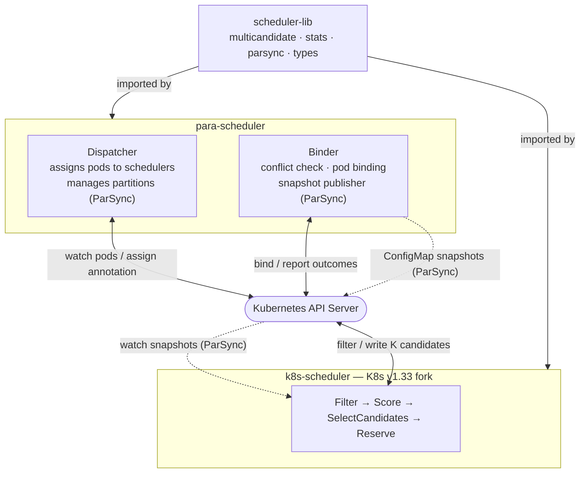

# ParKour: Conflict-Aware Parallel Scheduling for Large-Scale Kubernetes Clusters

[](LICENSE)

ParKour is a research prototype that improves scheduling throughput and reduces resource-conflict rates in large-scale Kubernetes clusters running multiple scheduler instances in parallel. It combines three mechanisms:

1. **Multicandidate Selection** — each scheduling decision produces a ranked list of K candidate nodes. On a bind failure, the Binder retries the next candidate without re-invoking the scheduler.
2. **Conflict-Rate Penalty** — each node's score is adjusted by its observed historical conflict rate, discouraging schedulers from converging on the same nodes.
3. **ParSync Partition Synchronization** — a time-driven, rotational sync strategy (from [ATC'21](https://www.usenix.org/conference/atc21/presentation/feng-yihui)) that divides nodes into M partitions and refreshes each partition on a bounded-staleness schedule.

---

## Architecture



The Dispatcher assigns incoming pods to scheduler instances and (in ParSync mode) manages partition configuration via the `ParSyncConfig` CRD. Each scheduler selects K candidate nodes using `scheduler-lib`. The Binder binds pods using the candidate list, detects conflicts, reports outcomes back, and (in ParSync mode) publishes per-partition node snapshots to ConfigMaps for schedulers to consume.

For the full design, see [docs/system-design.md](docs/system-design.md).

---

## Repository Structure

```
parkour/
├── scheduler-lib/          Core algorithm library (no K8s dependencies)
│   ├── multicandidate/     Candidate selection + strategies
│   ├── parsync/            Partition sync engine
│   ├── stats/              Conflict-rate tracking
│   ├── storage/            Storage abstraction
│   └── types/              Shared types + provider interfaces
│
├── para-scheduler/         Dispatcher + Binder processes
│   ├── cmd/dispatcher/     Dispatcher entry point
│   ├── cmd/binder/         Binder entry point
│   └── pkg/                Supporting packages
│       ├── dispatcher/     Pod assignment + ParSync coordination
│       ├── binder/         Binding + conflict detection + snapshot publisher
│       ├── cache/          Lightweight NodeInfo tracking
│       ├── annotation/     Candidate-list annotation serialization
│       └── metrics/        Prometheus metrics
│
├── k8s-scheduler/          K8s v1.33 fork with ParKour integration
│   └── pkg/scheduler/
│       ├── scheduler_parasched.go   Adapter + provider implementations
│       ├── parasched_sync.go        ParSync consumer + AdoptionStats watcher
│       └── schedule_one.go          Single-pod scheduling loop (modified)
│
├── para-sched-api/         CRD type definitions + generated clients
│   └── apis/v1/            ParSyncConfig / SchedulerAssignment / AdoptionStats
│
├── godel-scheduler/        Reference: KubeWharf Godel Scheduler (git subtree)
│
├── perf-tests/             K8s perf-tests fork (ClusterLoader2)
│
├── simulation/             Python discrete-event simulator
│   ├── core.py             Fill-simulation state machine
│   ├── config.py           Model and case configuration
│   ├── common/             Matrix runner, cache validation, plotting helpers
│   ├── figures/            Self-contained figure packages (fig3-fig8)
│   └── tests/              Engine semantics tests
│
├── experiments/            Cluster experiment infrastructure
│   ├── experiment-design.md  What each experiment board measures, and why
│   ├── scripts/            run-experiment.sh and supporting scripts
│   ├── kwok-setup/         KWOK node templates + ClusterLoader2 manifests
│   ├── trace/              Offline production-trace profiling
│   └── manifests/          Control-plane + monitoring configs
│
├── docs/
│   └── system-design.md    Architecture and algorithm reference
│
├── Makefile
└── LICENSE                 Apache 2.0
```

---

## Environment Requirements

### Simulation (Python)

- Python 3.9+
- `numpy`, `matplotlib`, `pytest`

```bash
pip install numpy matplotlib pytest
```

### Cluster Experiments (Go / Kubernetes)

| Component | Version |
|---|---|
| Go | 1.22+ |
| Kubernetes | 1.33+ |
| KWOK | 0.7+ |
| ClusterLoader2 | from `perf-tests/` |
| Prometheus | any recent version |
| kubectl | matching cluster version |

---

## Quick Start: Simulation

The simulator models parallel scheduling in a discrete-event environment. It is useful for fast exploration of how scheduler count, sync period, candidate count, and conflict-rate penalty interact.

Each paper figure is a self-contained package under `simulation/figures/`, run in three steps: generate the raw cache, verify it, then plot from the hash-locked verified cache. No caches or figures are distributed; every package regenerates its own.

```bash
cd simulation

# Generate, verify and plot one figure
python3 figures/fig4_conflict/run.py --jobs 8
python3 figures/fig4_conflict/verify.py
python3 figures/fig4_conflict/plot.py

# Engine tests
python3 -m pytest -q tests
```

Two packages read a neighbour's verified cache, so the run order matters. See [simulation/README.md](simulation/README.md) for the full workflow, the figure-to-package mapping and the model semantics.

---

## Quick Start: Cluster Experiments

Cluster experiments use a real (or KWOK-simulated) K8s 1.33 cluster with Prometheus metrics.

### 1. Build

```bash
# Algorithm library
cd scheduler-lib && go build ./...

# Dispatcher and Binder
cd para-scheduler && go build ./cmd/dispatcher ./cmd/binder

# k8s-scheduler fork (requires Linux or cross-compilation)
cd k8s-scheduler && make build
```

### 2. Deploy

```bash
# Apply CRDs and RBAC
kubectl apply -f para-sched-api/config/

# Deploy Dispatcher, Binder, and Schedulers
# (edit experiments/manifests/ to match your cluster)
kubectl apply -f para-scheduler/deploy/lab-cluster/
```

### 3. Run

```bash
# Set your Prometheus pushgateway endpoint
export PROMETHEUS_URL=http://<your-prometheus-host>:9091

bash experiments/scripts/run-experiment.sh \
  --nodes 10000 \
  --schedulers 10 \
  --sync-mode periodic \
  --sync-period 3.0 \
  --partitions 10 \
  --strategy QualityFirst \
  --penalty 0.3 \
  --candidates 3
```

See [experiments/README.md](experiments/README.md) for the full setup guide, KWOK configuration, and all available flags.

---

## Configuration Reference

### Dispatcher (`para-scheduler/cmd/dispatcher`)

| Flag | Default | Description |
|---|---|---|
| `--scheduler-names` | `sched-0,sched-1` | Comma-separated scheduler instance names |
| `--sync-mode` | `event` | `event` (event-driven) or `periodic` (ParSync) |
| `--sync-pattern` | `diff` | `glob`, `same`, or `diff` (ParSync only) |
| `--sync-period` | `3s` | Full sync period G (ParSync only) |
| `--num-partitions` | `3` | Number of node partitions M (ParSync only) |
| `--expected-nodes` | `0` | Node-count gate for /ready endpoint (0 = disabled) |
| `--workers` | `2` | Number of dispatch workers |
| `--kube-api-qps` | `10000` | API server QPS limit |
| `--kube-api-burst` | `10000` | API server burst limit |

### Binder (`para-scheduler/cmd/binder`)

| Flag | Default | Description |
|---|---|---|
| `--sync-mode` | `event` | `event` or `periodic` |
| `--sync-period` | `3s` | Full sync period G |
| `--num-partitions` | `3` | Number of partitions M |
| `--workers` | `4` | Number of bind workers |
| `--snapshot-flush-interval` | `100ms` | Snapshot publish batch window (ParSync only) |
| `--stats-flush-period` | `1s` | AdoptionStats CRD flush period |
| `--assumed-pod-ttl` | `30s` | TTL for assumed pods in cache |

### Scheduler (`k8s-scheduler/cmd/kube-scheduler`)

ParKour-specific flags are prefixed with `--parasched-`:

| Flag | Default | Description |
|---|---|---|
| `--parasched-name` | `""` | Scheduler instance name; enables ParKour when set |
| `--parasched-enable-parsync` | `false` | Enable ParSync partition sync mode |
| `--parasched-k-candidates` | `3` | Number of candidates K to select |
| `--parasched-strategy` | `QualityFirst` | Scoring strategy: `QualityFirst`, `LatencyFirst`, `WeightedRandom` |
| `--parasched-penalty` | `0.3` | Conflict-rate penalty weight p ∈ [0, 1] |

---

## Documentation

- [docs/system-design.md](docs/system-design.md) — Architecture, algorithms, data types, and design decisions
- [simulation/README.md](simulation/README.md) — Simulator workflow, figure packages, and model semantics
- [experiments/README.md](experiments/README.md) — Cluster experiment setup and reproduction steps
- [experiments/experiment-design.md](experiments/experiment-design.md) — What each experiment board measures, its baselines, and its metric definitions

No measurement results are distributed with this repository. Simulation caches
(`simulation/figures/*/data/`), rendered figures (`simulation/figures/*/output/`)
and cluster results (`experiments/results/`) are all generated locally and
excluded from version control.

---

## License

Apache License 2.0. See [LICENSE](LICENSE).

## Acknowledgments

- [Godel Scheduler](https://github.com/kubewharf/godel-scheduler) — production parallel scheduler (architectural inspiration)
- [Kubernetes](https://github.com/kubernetes/kubernetes)
- [perf-tests / ClusterLoader2](https://github.com/kubernetes/perf-tests)
- [KWOK](https://kwok.sigs.k8s.io/) — Kubernetes Without Kubelet
- [ATC'21 ParSync paper](https://www.usenix.org/conference/atc21/presentation/feng-yihui) — partitioned synchronization algorithm