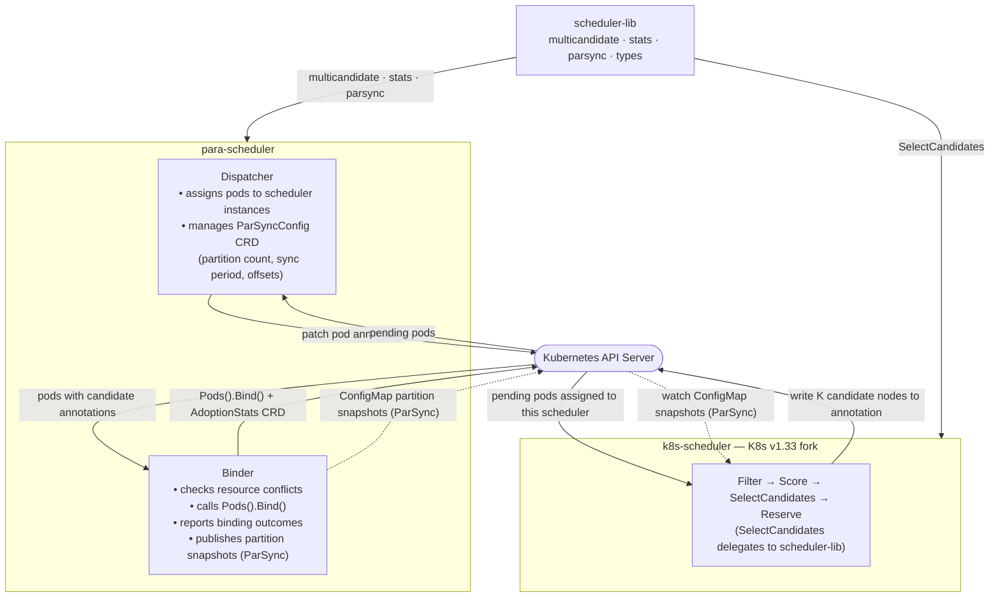

# ParKour System Design

## 1. Overview

In large-scale Kubernetes clusters running multiple scheduler instances, schedulers share the same pool of nodes but maintain separate local views of cluster state. This leads to two classes of resource conflicts:

- **Bind-race conflict**: Two schedulers select the same node for different pods simultaneously. The first binding succeeds; the second fails at the API server and must retry.
- **Stale-state conflict**: A scheduler's local state lags behind the actual cluster state (due to infrequent synchronization), causing it to select nodes that are already resource-exhausted.

ParKour addresses both conflict types with three complementary mechanisms:

1. **Multicandidate Selection** — select K candidate nodes per scheduling decision instead of just one. On a bind failure, the binder retries with the next candidate in the list, avoiding a full re-scheduling cycle.
2. **Conflict-Rate Penalty** — adjust each node's score at selection time using its observed conflict rate. Nodes with higher historical conflict rates receive lower adjusted scores, causing schedulers to spread their selections.
3. **ParSync Partition Synchronization** — a time-driven rotational sync strategy inspired by [ATC'21 "Scaling Large Production Clusters with Partitioned Synchronization"](https://www.usenix.org/conference/atc21/presentation/feng-yihui). Nodes are divided into M partitions; each scheduler rotates through partitions, applying one partition's fresh snapshot every G/M seconds, completing a full state refresh every G seconds.

---

## 2. Architecture

ParKour uses a Dispatcher-Scheduler-Binder separation, inspired by [godel-scheduler](https://github.com/kubewharf/godel-scheduler). The three components communicate through Kubernetes API objects.



### Component Roles

| Component | Process | Responsibility |
|---|---|---|
| **Dispatcher** | `para-scheduler/cmd/dispatcher` | Watches pending pods; assigns each pod to a scheduler instance via annotation; manages ParSyncConfig CRD (partition count, sync period, per-scheduler offsets) |
| **Scheduler** | `k8s-scheduler/cmd/kube-scheduler` | Forked from K8s v1.33; handles Filter → Score → SelectCandidates → Reserve; writes the top-K candidate node list to the pod annotation |
| **Binder** | `para-scheduler/cmd/binder` | Watches pods with candidate annotations; checks for resource conflicts; calls `Pods().Bind()`; reports binding outcomes; publishes partition snapshots to ConfigMaps (ParSync mode) |

---

## 3. Synchronization Paradigms

The sync mode is selected via the `--enable-parsync` flag on the Scheduler and Binder.

| Paradigm | Trigger | Freshness | Use case |
|---|---|---|---|
| **Event-driven** | K8s informer pushes Pod/Node events in real time | Millisecond-level | Baseline comparison; shows bind-race conflict without stale-state component |
| **ParSync (periodic)** | Binder batches and publishes partition snapshots to ConfigMaps; Scheduler applies them on a rotational schedule | Bounded by sync period G | Production-oriented; ParSync paper replication |

### ParSync Internals

In ParSync mode the Scheduler's pod informer handlers (`addPodToCache`, `updatePodToCache`, `deletePodFromCache`) are **not registered**. The Binder's partition snapshots become the sole authoritative source of node resource state. This decoupling prevents a race between the pod informer and `UpdateNodeResources` that would inflate bind conflicts.

**Snapshot publication (Binder side):**
1. After each successful bind, `MarkDirty(partitionID)` is called.
2. A background flush loop (default window 100 ms) batches dirty partitions and writes each partition snapshot to ConfigMaps, chunked at 5000 nodes per chunk (`parasched-snapshot-{partitionID}-c{chunkIndex}`).
3. A heartbeat timer periodically marks all partitions dirty even when no bindings occur, ensuring schedulers always receive bounded-staleness snapshots.

**Snapshot consumption (Scheduler side):**
1. A single goroutine watches all partition-snapshot ConfigMaps via a LabelSelector.
2. When a Watch event arrives, the chunks are reassembled into a `PartitionSnapshot` and stored in `pendingSnapshots[partitionID]`.
3. A rotational ticker fires every G/M seconds. On each tick, the next partition's pending snapshot is applied to the local node cache.
4. After M ticks (one full period G), all partitions have been refreshed once.

**sameSync vs. diffSync** — configurable via `--sync-pattern`:

```
sameSync (N=2 schedulers, M=3 partitions, G=3 s):
  Scheduler_0: t=0 → partition 0,  t=1 → partition 1,  t=2 → partition 2
  Scheduler_1: t=0 → partition 0,  t=1 → partition 1,  t=2 → partition 2
  (all schedulers sync the same partition simultaneously)

diffSync  (N=2 schedulers, M=3 partitions, G=3 s):
  Scheduler_0: t=0 → partition 0,  t=1 → partition 1,  t=2 → partition 2
  Scheduler_1: t=0 → partition 1,  t=1 → partition 2,  t=2 → partition 0
  (schedulers hold diverse state views at any given moment)
```

---

## 4. Multicandidate Selection

**Core idea**: instead of selecting only the top-scored node, select the top-1 preferred node plus K-1 backup candidates. The Binder attempts the preferred node first; on conflict, it retries with the next candidate without re-invoking the scheduler.

**Implementation**: `scheduler-lib/multicandidate/`

```
scheduler-lib/multicandidate/
├── selector.go      CandidateSelector — main entry point
├── strategy.go      QualityFirst / LatencyFirst / WeightedRandom
├── factory.go       NewStrategy(cfg *StrategyConfig) factory
└── config.go        StrategyConfig fields
```

**Selection pipeline** (inside `CandidateSelector.SelectCandidates`):

1. Sort nodes by raw plugin score (descending).
2. `filterByScoreThreshold` — drop nodes below a minimum score.
3. For each remaining node, enrich with metadata from providers:
   - `ConflictRate` ← `AdoptionStatsProvider.GetNodeConflictRate(nodeName)`
   - `PartitionID` ← `PartitionStateProvider.GetPartitionID(nodeName)`
   - `Freshness` ← `PartitionStateProvider.GetPartitionStaleness(partitionID)`
4. Call `strategy.Select(candidates, K)` to produce the final ranked list.

**Scoring strategies**:

| Strategy | Formula | Purpose |
|---|---|---|
| `QualityFirst` | `score = (1−p)·normScore + p·(1−conflictRate)` | Balances node quality with conflict avoidance; `p` = penalty weight |
| `LatencyFirst` | `score = freshness`; tiebreak by `normScore` | Minimizes stale-state conflicts in ParSync mode |
| `WeightedRandom` | Weighted sampling by `(1−p)·normScore + p·(1−conflictRate)` | Adds randomness to reduce selection correlation between schedulers |

The selected K nodes are serialized to a JSON annotation on the pod and read by the Binder.

---

## 5. Conflict-Rate Penalty

**Core idea**: maintain a per-node exponential moving average of the conflict rate. Nodes with higher observed conflict rates receive a lower adjusted score, discouraging multiple schedulers from converging on the same hot nodes.

**Implementation**: `scheduler-lib/stats/`

```
scheduler-lib/stats/
├── adoption_cache.go   AdoptionCache — per-node sliding-window statistics
├── probability.go      ProbabilityCalculator — conflict rate to [0,1]
└── sliding_window.go   SlidingWindow — time-bucketed event counter
```

**Data flow**:
1. Binder reports each binding outcome (success / conflict) to the `AdoptionStats` CRD.
2. Scheduler reads the CRD via informer and updates the local `AdoptionCache`.
3. `ProbabilityCalculator.GetNodeConflictRate(nodeName)` returns the smoothed conflict rate.
4. `CandidateSelector` passes this rate to the scoring strategy.

---

## 6. scheduler-lib: Single Source of Truth

`scheduler-lib` is an independent Go module (no Kubernetes dependencies) that contains all parallel-scheduling algorithm logic. Both `para-scheduler` and `k8s-scheduler` are integration layers that call `scheduler-lib` through thin adapters — they must not re-implement its functionality.

```
scheduler-lib/
├── multicandidate/   Candidate selection + strategy implementations
├── parsync/          Partition management, freshness calculation, sync scheduling
├── stats/            Adoption cache, conflict probability, sliding windows
├── storage/          Storage abstraction (memory backend; K8s CRD backend not in lib)
├── types/            Shared type definitions (CandidateNode, BindingResult, etc.)
└── examples/         Usage examples
```

**Adapter interfaces** that integration layers must implement:

```go
// AdoptionStatsProvider — implemented by k8s-scheduler and para-scheduler
type AdoptionStatsProvider interface {
    GetNodeConflictRate(nodeName string) float64
}

// PartitionStateProvider — implemented by k8s-scheduler
type PartitionStateProvider interface {
    GetPartitionID(nodeName string) int
    GetPartitionStaleness(partitionID int) float64
}
```

**Allowed exception**: the `storage` package. Kubernetes uses CRDs as the persistence layer, which is incompatible with the in-memory `storage.Storage` interface in the library; each integration layer manages its own CRD clients.

---

## 7. Key Data Types

### CandidateNode (`scheduler-lib/types`)

```go
type CandidateNode struct {
    NodeScore                // embedded: NodeName string, Score int64
    Rank         int         // position in the candidate list (0 = preferred)
    ConflictRate float64     // observed conflict rate [0, 1]
    PartitionID  int         // assigned partition index
    Freshness    float64     // staleness score [0, 1]; lower = more stale
    Reason       string      // human-readable selection rationale
}
```

### BindingResult (`scheduler-lib/types`)

```go
type BindingResult struct {
    PodName      string
    PodNamespace string
    NodeName     string
    Success      bool
    Conflict     bool        // true when resource conflict prevented binding
    CandidateIdx int         // which candidate index was used (0 = preferred)
}
```

### ParSyncConfig CRD (`para-sched-api/apis/v1`)

```go
type ParSyncConfigSpec struct {
    NumPartitions  int     `json:"numPartitions"`   // M — number of node partitions
    SyncPeriod     float64 `json:"syncPeriod"`      // G — full sync cycle in seconds
    SyncPattern    string  `json:"syncPattern"`     // "sameSync" or "diffSync"
    NumSchedulers  int     `json:"numSchedulers"`   // N — number of scheduler instances
}
```

### SchedulerAssignment CRD (`para-sched-api/apis/v1`)

Written by the Dispatcher for each pending pod. Tells each scheduler which pods are assigned to it.

---

## 8. Repository Structure

```
parkour/
├── scheduler-lib/          Algorithm library (no K8s deps)
│   ├── multicandidate/     Candidate selection + strategies
│   ├── parsync/            Partition sync engine
│   ├── stats/              Conflict-rate tracking
│   ├── storage/            Storage abstraction
│   └── types/              Shared types + provider interfaces
│
├── para-scheduler/         Dispatcher + Binder processes
│   ├── cmd/dispatcher/     Dispatcher entry point
│   ├── cmd/binder/         Binder entry point
│   └── pkg/                Supporting packages
│
├── k8s-scheduler/          K8s v1.33 fork with ParKour integration
│   └── pkg/scheduler/      ParKour hooks in schedule_one.go +
│       para-sched/         scheduler_parasched.go + parasched_sync.go
│
├── para-sched-api/         CRD type definitions + generated clients
│   └── apis/v1/            ParSyncConfig, SchedulerAssignment, AdoptionStats
│
├── godel-scheduler/        Reference: KubeWharf Godel Scheduler (git subtree)
│
├── simulation/             Python discrete-event simulator
│   ├── paraScheduling.py   Simulator core
│   ├── scheduler.py        Per-scheduler state + candidate selection
│   ├── exp.py              Parameter sweep driver
│   └── exp_fig*.py         Figure reproduction scripts
│
├── experiments/            Cluster experiment infrastructure
│   ├── scripts/            run-experiment.sh + supporting scripts
│   ├── kwok-setup/         KWOK node and ClusterLoader2 manifests
│   └── manifests/          K8s control-plane + monitoring configs
│
└── docs/
    └── system-design.md    This document
```